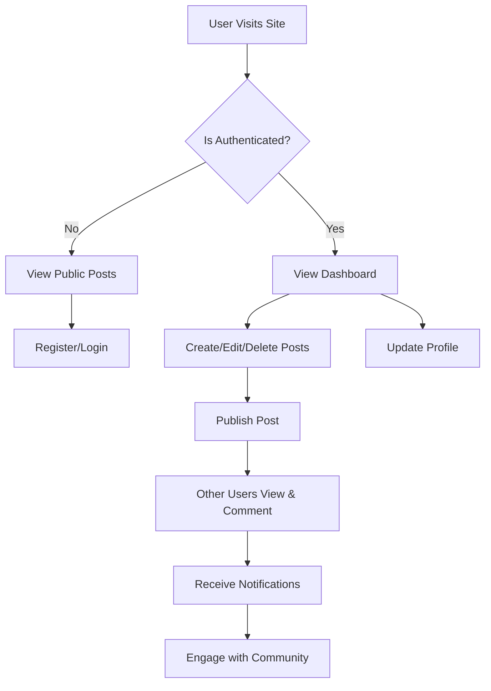

# Blogspire - Multi-Author Blog Platform


A full-featured multi-author blog application built with Django that allows users to create, read, update, and delete blog posts. The platform includes user authentication, rich text editing, comments, and like functionality.

## 🌟 Features

- **User Authentication**: Register, login, logout, and password reset functionality
- **User Profiles**: Customizable user profiles with profile pictures
- **Rich Text Blog Posts**: Create and edit blog posts with rich text formatting using CKEditor
- **Comments System**: Readers can leave comments on blog posts
- **Like Feature**: Users can like/unlike blog posts
- **Responsive Design**: Works on desktop and mobile devices
- **Admin Panel**: Built-in Django admin interface for content management

## 🛠️ Tech Stack

- **Backend**: Django 3.1.3
- **Frontend**: HTML5, CSS3, Bootstrap 4
- **Database**: SQLite (Development), PostgreSQL (Production-ready)
- **Rich Text Editor**: CKEditor
- **Authentication**: Django's built-in authentication system
- **Image Processing**: Pillow

## 📋 Prerequisites

- Python 3.6+
- pip (Python package manager)
- Virtual Environment (recommended)

## 🚀 Installation

1. **Clone the repository**
   ```bash
   git clone https://github.com/yourusername/Blogspire.git
   cd Blogspire
   ```

2. **Create and activate a virtual environment**
   ```bash
   # Windows
   python -m venv venv
   .\venv\Scripts\activate
   
   # macOS/Linux
   python3 -m venv venv
   source venv/bin/activate
   ```

3. **Install dependencies**
   ```bash
   pip install -r requirements.txt
   ```

4. **Apply migrations**
   ```bash
   python manage.py makemigrations
   python manage.py migrate
   ```

5. **Create a superuser (admin)**
   ```bash
   python manage.py createsuperuser
   ```

6. **Run the development server**
   ```bash
   python manage.py runserver
   ```

7. **Access the application**
   - Website: http://127.0.0.1:8000/
   - Admin Panel: http://127.0.0.1:8000/admin

## 📝 Project Structure

```
Blogspire/
├── blog/                      # Main blog application
│   ├── migrations/            # Database migrations
│   ├── static/                # Static files (CSS, JS, images)
│   ├── templates/             # HTML templates
│   ├── admin.py               # Admin site configurations
│   ├── apps.py                # App configurations
│   ├── forms.py               # Form definitions
│   ├── models.py              # Database models
│   ├── urls.py                # URL routing
│   └── views.py               # View functions
│
├── users/                     # User management app
│   ├── migrations/            # Database migrations
│   ├── static/                # Static files
│   ├── templates/             # HTML templates
│   ├── admin.py               # Admin configurations
│   ├── apps.py                # App configurations
│   ├── forms.py               # User forms
│   ├── models.py              # User models
│   └── views.py               # User views
│
├── django_project/            # Main project configuration
│   ├── __init__.py
│   ├── settings.py           # Project settings
│   ├── urls.py               # Main URL configuration
│   └── wsgi.py               # WSGI configuration
│
├── media/                    # User-uploaded files
├── static/                   # Global static files
├── manage.py                 # Django management script
└── requirements.txt          # Project dependencies
```

## 🔄 Application Flow



## 📱 Features in Detail

### User Authentication
- Secure user registration and login
- Password reset functionality
- Email verification (configurable)
- Profile management

### Blog Management
- Create, read, update, and delete blog posts
- Rich text editing with CKEditor
- Categories and tags
- Featured images

### Social Features
- Like/Unlike posts
- Comments system
- User profiles
- Follow/Unfollow authors

### Admin Panel
- Full-featured admin interface
- User management
- Content moderation
- Site analytics

## 🔒 Security Features
- CSRF protection
- SQL injection prevention
- XSS protection
- Secure file uploads
- Password hashing

## 📈 Future Enhancements
- [ ] Implement real-time notifications
- [ ] Add search functionality
- [ ] Enable social media sharing
- [ ] Implement user following system
- [ ] Add email subscriptions

## 🤝 Contributing

Contributions are welcome! Please follow these steps:

1. Fork the repository
2. Create your feature branch (`git checkout -b feature/AmazingFeature`)
3. Commit your changes (`git commit -m 'Add some AmazingFeature'`)
4. Push to the branch (`git push origin feature/AmazingFeature`)
5. Open a Pull Request

## 📄 License

This project is licensed under the MIT License - see the [LICENSE](LICENSE) file for details.

## 🙏 Acknowledgments

- Django Documentation
- Bootstrap
- CKEditor
- Stack Overflow Community

---

<div align="center">
    Made with ❤️ by [Your Name] | [Your Website]
</div>


A complete Blog Apllication from end to end 
